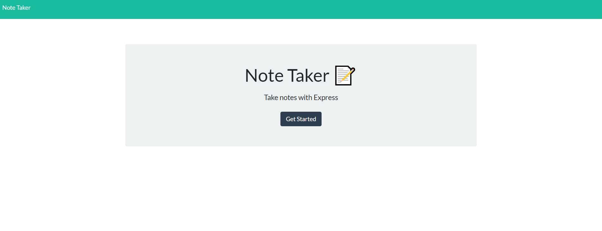

# **Note Taker** 

## *Summary*
---
The purpose of this project is to display the functionality of the note taker app. The user should be able to add notes, save them, update them, and delete them. 

- Motivation for this project was to be able to create, update, and post notes so that the user would be able to track it as time progresses.
- I built this project so that I would get a better understanding of route functions
- The note taker app solves the problem of needing to track notes throughout yur routine lifestyle

---

## Table of Contents

- [Demo](#demo)

## Demo :

## Author
### Robert Barnes
Full-Stack Web Developer: 
[Github](https://github.com/okingdomz/express-projecttt).